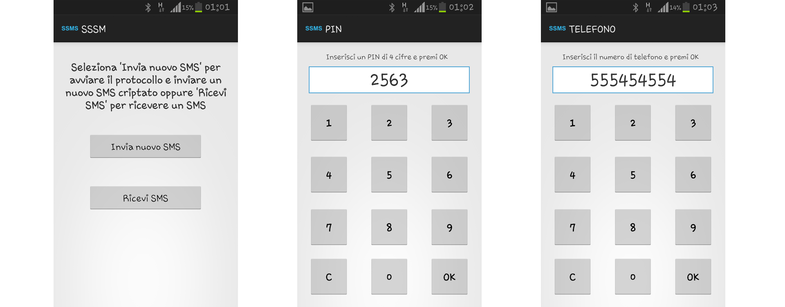

# SSMS - SecureSMS
A sample Android application that allows to exchange encrypted SMS.

## Description
On Android device it is possible to intercept SMS text message before they
leave the phone or as soon as they are received. To avoid this privacy issue it
is possible to implement an SMS encyption app to exchange SMS messages
with other users sharing the same apps. The users have both a public and
private key. When a user wants to start a private communication with a
peer, a protocol to establish a session key is started. Design and analyze a
protocol which satisfies the following requirements:
* At the end of the protocol, both peers share a session key for symmetric
encryption of SMS messages.
* At the end of the protocol, both peers are sure that the other peer
received the session key.
* Expiring PINs should be used to ensure freshness.
* The key exchange protocol is performed through SMS
text messages, while PINs are manually inserted by users.

## Screenshots
